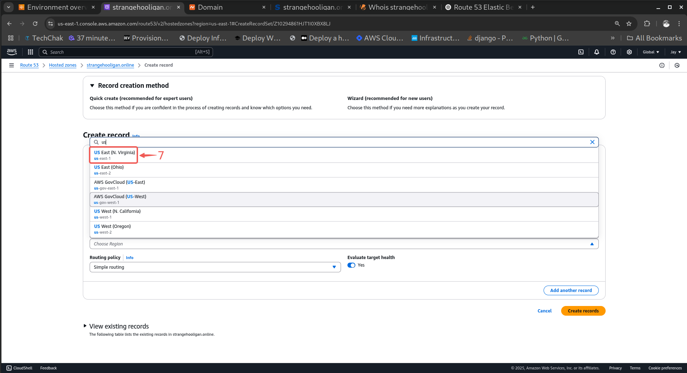

# Setting Up a Custom Domain with Amazon Route 53

## Introduction

As a continuation of my [**CI/CD project**](https://github.com/StrangeJay/AWS_CICD/blob/master/journal.md), where I successfully deployed a web application to AWS Elastic Beanstalk, the next logical step is to associate the application with a custom domain name for easier access and a more professional presence.

Amazon Route 53 is a scalable and highly available Domain Name System (DNS) web service designed to route users to applications hosted on AWS or elsewhere. In this phase of the project, I’ll use Route 53 to create a hosted zone, and configure DNS records to map the custom domain to the Elastic Beanstalk environment.

This documentation outlines how to:

- Use an existing domain with Route 53

- Create and manage a hosted zone

- Configure DNS settings to route traffic to the Elastic Beanstalk app

- Enable HTTPS using ACM and a load balancer

By the end of this guide, the deployed app will be accessible through a clean, memorable domain name, completing the final touch on a fully automated deployment pipeline.

---

## Route53 Project

|S/N | Project Tasks                              |
|----|--------------------------------------------|
| 1  |Create a hosted zone                        |
| 2  |Route traffic from DNS provider to Route53  |
| 3  |Create A record                             |
| 4  |Enable https using ACM                      |
| 5  |Test setup                                  |

## Documentation

### Create a hosted zone and Route traffic from DNS provider to Route53

- Type **route 53**① in the search bar, and select **Route 53**② from the provided list of services.

- Click on the **Get started**③ button.

- Choose **Create hosted zones**④ and then click the **Get started**⑤ button.

- Type in your **Domain name**⑥ and click the **Create hosted zone**⑦ button.

- Go to your domain registrar's dashboard, find the domain you want to use, and click the **Manage**⑧ button.

> [!NOTE]
Your domain name registrar's interface might look different, but they all follow a similar basic layout.

- Select **Custom DNS**⑨ within the NAMESERVERS section.

- Return to your AWS console, select the **created hosted zone**⑩ and copy the assigned **values**⑪.

- Go back to your domain name registrar and Paste the values you copied from Route 53 into the appropriate fields, then click the **checkmark symbol**⑫ to save the changes.

- If done correctly, you should see a message similar to this, indicating that the server update may take some time.

---

### Create an A record

- Open your AWS console in a new tab, search for 'elastic beanstalk' in the search bar and select **Elastic Beanstalk**① from the list of services.

- Click on the created Elastic Beanstalk **environment**②.

- Copy the **Domain**③ URL.

- Return to the Route53 tab and click on **Create record**④.

> [!NOTE]
If your Elastic Beanstalk environment uses a load balancer (which it usually does), you can use an Alias A record.

- Toggle on the **Alias**⑤ button.

- Select **Alias to Elastic Beanstalk environment**⑥.

- Select the **region**⑦ where your Elastic Beanstalk environment is deployed.

- Choose your **elastic beanstalk environment**⑧.

- Click the **Create records**⑨ button to create your root domain.

- Begin the record creation process again, but this time, enter **www**⑩ in the record name field to create your subdomain.

- Repeat the same steps used to create the root domain, then click the **Create records**⑪ button to finalize the process.

- Visit your domain in a browser to confirm that it's been successfully created and is resolving correctly.

> [!NOTE]
You may see a 'Not Secure' warning in the browser, indicating that HTTPS has not yet been enabled for your domain.

---

### Enable https using ACM

- Type in certificate manager in the search bar and select **Certificate Manager**① from the list of services.

- Click on the **Request a certificate**② button.

- Click **Next**③.

- Enter your **domain name**④, then click **Add another domain name to this certificate**⑤ to include additional domains.

- Type in **`*.<your domain name>`⑥** and click the **Request**⑦ button to submit your certificate request. 

> [!NOTE]
When creating a certificate in AWS Certificate Manager (ACM), using `*.yourdomain.com` generates a wildcard certificate that secures all **first-level subdomains** of your domain (e.g., `www.yourdomain.com`, `app.yourdomain.com`). However, it does **not** cover the root domain (`yourdomain.com`) or deeper-level subdomains (e.g., `dev.api.yourdomain.com`). To ensure both the root domain and subdomains are secured, include **both** `*.yourdomain.com` and `yourdomain.com` in the certificate request.

- Click on **Create records in Route53**⑧ to automatically generate the necessary DNS records.

- Select both domain names and click **Create records**⑨ to finalize the DNS record creation.

- If everything was set up correctly, you should see the **`Issued`** status, as shown in the picture below.

- Visit your domain to verify that it is now secure and the 'Not Secure' warning has been removed.

---

With Route 53 properly configured, our application now benefits from a custom domain name, reliable DNS routing, and secure HTTPS access using ACM. This not only improves user experience and branding but also aligns with best practices for modern application deployment on AWS.

Integrating Route 53 into this CI/CD workflow demonstrates how domain management, security, and scalability can be seamlessly handled within the AWS environment. As the application evolves, Route 53 makes it easy to manage subdomains, handle traffic routing policies, and support failover or latency-based configurations.

This marks the final step in the journey from automated deployment to production-ready hosting, complete with a custom, secure, and highly available domain setup.
